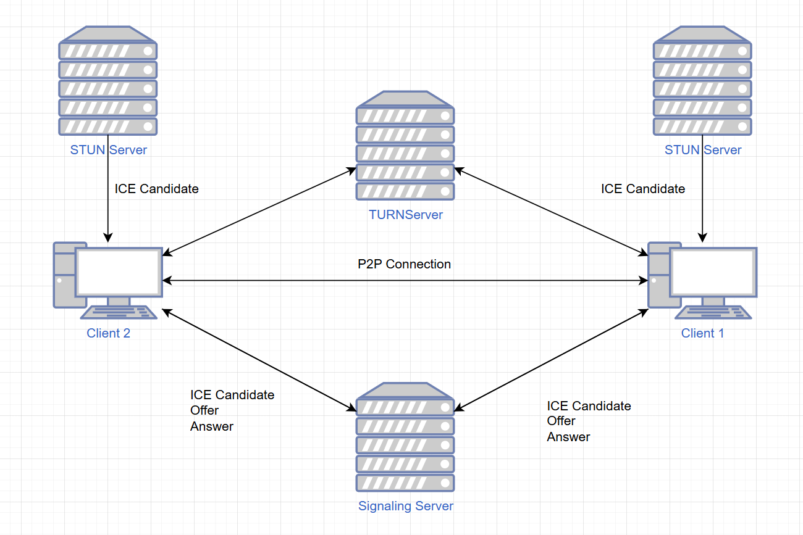

### Чат с возможностью аудиозвонка
Представляет собой модульный проект, в котором функционал простого чата на **Websocket** и **P2P** аудиозвонка. Основные технологии: **Java**, **Spring**, **Websocket**, **STOMP**, **WebRTC**, **Swing**. Чат реализован при помощи **Websocket**, **STOMP** поверх и простого **брокера** **сообщений**, который отвечает за пересылку текстового сообщения всем клиентам, подписанным на топик брокера. Аудиозвонок реализуется при помощи библиотеки **_webrtc-java_** - обёртки **WebRTC** для языка **Java**. **Swing** используется для GUI клиентского приложения.

Модуль **_client_** - файлы для сборки клиентского приложения, модуль **_server_** - для серверной части, оба зависят от общих файлов из отдельного модуля **_common_**. Таким образом, все файлы хранятся вместе и общие классы не дублируются.

### Принцип работы аудиозвонка при помощи WebRTC
Чтобы установить соединение клиентов, они должны обменяться сигнальными сообщениями - **_Offer_**, **_Answer_** и **_ICE candidates_**. Сообщения передаются через **_Signaling Server_**. Сначала "инициатор" генерирует **Offer** и устанавливает его у себя как **_Local Description_**. Второй клиент принимает **Offer** от сервера сигнализации и устанавливает его как **_Remote Description_**, генерирует **Answer**, устанавливает его как **Local Description** и так же передаёт его через сервер инициализации. Первый клиент устанавливает ответ как **Remote Description**. Затем серверы обмениваются **ICE candidates**, которые они полчают от **_STUN_** сервера (например: stun:stun.l.google.com:19302). Соединения таким образом может установиться только при "удачной" конфигурации сетевой топологии, поэтому, если соединение не может установиться при помощи **STUN** сервера, добавляется **_TURN_** сервер, который выступает в роли ретранслятора и пересылает пакеты, которыми обмениваются клиенты.


### Настройка TURN сервера
Базовую настройку **TURN** сервера можно реализовать при помощи docker-compose файла. Пример docker-compose.yml:
```
version: '3.8'

services:
  coturn:
    image: instrumentisto/coturn
    container_name: coturn
    restart: unless-stopped
    network_mode: host 
    command: >
      --log-file=stdout
      --min-port=49160
      --max-port=49200
      --realm=ip_address_of_turn_server
      --external-ip=ip_address_of_turn_server
      --lt-cred-mech
      --user=client:secret01012005
      --no-tls
      --no-dtls
```
Вместо ip_address_of_turn_server нужно указать "белый" IP адрес сервера.

### Запуск
В клиенте нужно также указать адрес **TURN** сервера в **_PeerConnection_** и адрес сервера для чата в **_StompClient_** вместо **localhost**.
#### Сборка серверной части
Необходимо клонировать репозиторий на сервер, перейти в директорию проекта и выполнить команды (необязательно пробрасывать на 8080 порт):
```
docker build -t websocket_chat_server .
docker run -d -p 8080:8080 websocket_chat_server
```
Проверить запуск контейнера можно при помощи:
```
docker ps
```
#### Сборка клиентской части
Изначально нужно клонировать проект локально на клиентское устройство. Затем изначально необходимо собрать содержимое common:
```
maven clean install
```
Команда должна быть запущена в директории **_common_**.

Далее можно собирать приложение клиент (в директории **_client_**):
```
maven clean package
```